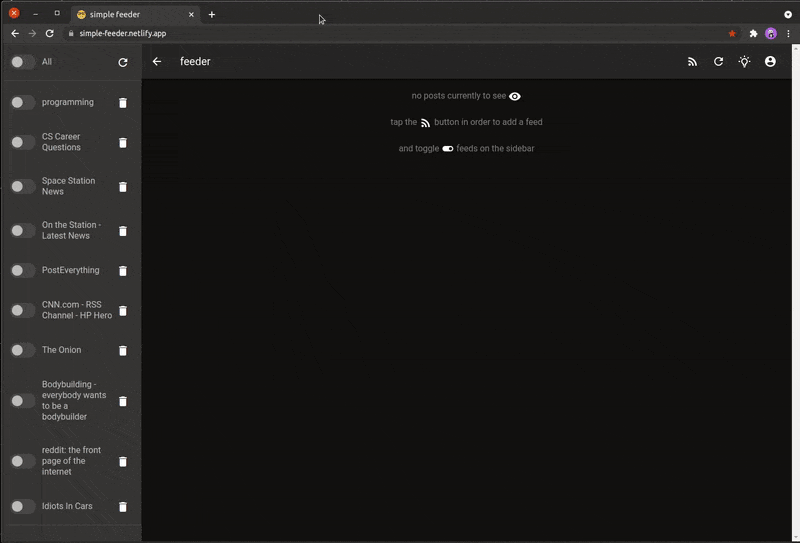

# simple feeder 

## Overview
This is a web application that lets you add, display, and filter any RSS feeds, and it is currently [deployed](https://simple-feeder.netlify.app/) on netlify. 

## Technologies
- VueJS
- Vuetify
- Netlify Lambda
- RSS Parser
### Project setup

    $ yarn install

### Compiles and hot-reloads for development
For local development, you will need to run

    $ yarn serve

in order to serve the client, and also

    $ yarn lambda

in order to serve the lambda functions locally.
### Compiles and minifies for production

    $ yarn build

### Lints and fixes files

    $ yarn lint
